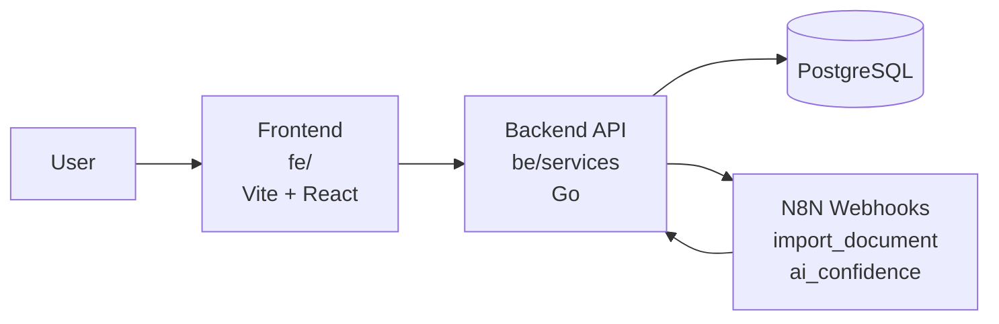
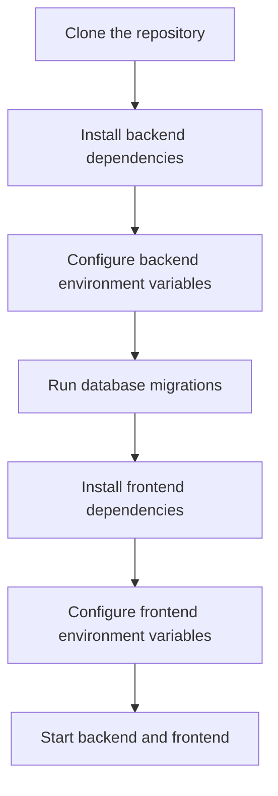

# <span style="color: lightblue">**Finicore**</span>

Finicore is a finance management platform with a Go backend and a Vite + React frontend. This document explains the project structure, the local setup flow, and where to find the main run instructions.

## Table of Contents

- [Overview](#overview)
- [Architecture Diagram](#architecture-diagram)
- [Local Setup](#local-setup)
- [Prerequisites](#prerequisites)
- [Run the Backend (Local)](#run-the-backend-local)
- [Run the Frontend (Local)](#run-the-frontend-local)
- [Run with Docker (Optional)](#run-with-docker-optional)
- [Project Links](#project-links)
- [Notes](#notes)

## Overview

The repository is split into two main parts:

- `be/` for the Go backend, services, migrations, and shared packages.
- `fe/` for the frontend application built with Vite and React.

The backend handles authentication, business transactions, audit logs, dashboards, reports, and AI confidence data. The frontend consumes those APIs and presents the finance workflow UI.

## Architecture Diagram



## Local Setup



### 1) Clone or open the repository

Open the workspace root so both `be/` and `fe/` are available.

### 2) Prepare the database

Make sure PostgreSQL is running and the target database exists. The schema files are in `be/migrations/` and the current database layout is also documented in `be/db.sql`.

### 3) Configure backend environment variables

Create or update the backend `.env` file with the values your local setup needs. The most important ones are:

- `DB_POSTGRES_HOST`
- `DB_POSTGRES_PORT`
- `DB_POSTGRES_USER`
- `DB_POSTGRES_PASSWORD`
- `DB_POSTGRES_NAME`
- `N8N_IMPORT_DOCUMENT_URL`
- `N8N_AI_CONFIDENCE_URL`

If you do not have N8N configured locally yet, the backend uses local webhook defaults during development.

### 4) Configure frontend environment variables

Create `fe/.env` and set the API base URL:

- `VITE_API_URL=http://localhost:3001/api/v1`

If you use a different backend port, update this value to match.

### 5) Install dependencies

Install backend and frontend dependencies before running anything.

```bash
cd be/services
go mod download

cd ../../fe
npm install
```

### 6) Run database migrations

Apply the migrations in `be/migrations/` before starting the backend so the tables exist.

### 7) Start the services

Start the backend first, then the frontend. If you also use N8N locally, make sure the webhook URLs are reachable before testing the AI flow.

## Prerequisites

- Go 1.22 or newer
- Node.js 18+ and `npm`
- PostgreSQL
- Optional: N8N for document import and AI confidence workflows

## Run the Backend (Local)

1. Open a terminal and change into the backend folder:

```bash
cd be/services
```

2. Set environment variables (example):

<!-- change these values as needed -->
```bash
DB_POSTGRES_USER="" 
DB_POSTGRES_PASSWORD=""
DB_POSTGRES_HOST=""
DB_POSTGRES_PORT=5432
DB_POSTGRES_NAME=""
```

3. Run the core service:

```bash
go run ./cmd/core-service
```

4. Run additional services as needed (e.g. audit, notification):

```bash
go run ./cmd/audit-service
go run ./cmd/notification-service
```

## Run the Frontend (Local)

1. Open a new terminal and change into the frontend folder:

```bash
cd fe
```

2. Install dependencies:

```bash
npm install
```

3. Start the dev server:

```bash
npm run dev
```

## Project Documentation  
- Backend README: [be/README.md](be/README.md)
- Frontend README: [fe/README.md](fe/README.md)

## Notes

- Keep the backend and frontend run sections in sync with the implementation, but avoid changing them unless the actual commands change.
- The AI confidence flow depends on the webhook responses from N8N and the `business_ai_confidence` table schema.
- If you are troubleshooting, start by checking environment variables, database connectivity, and webhook URLs.

